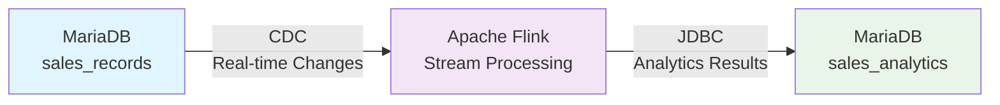
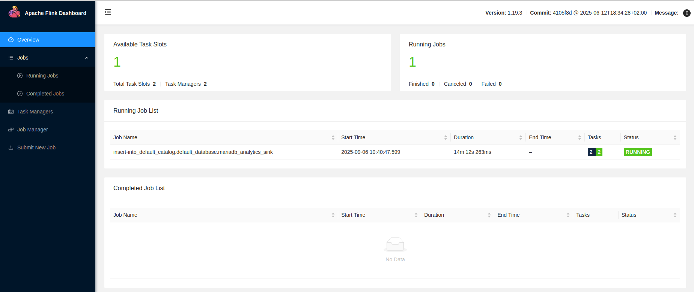
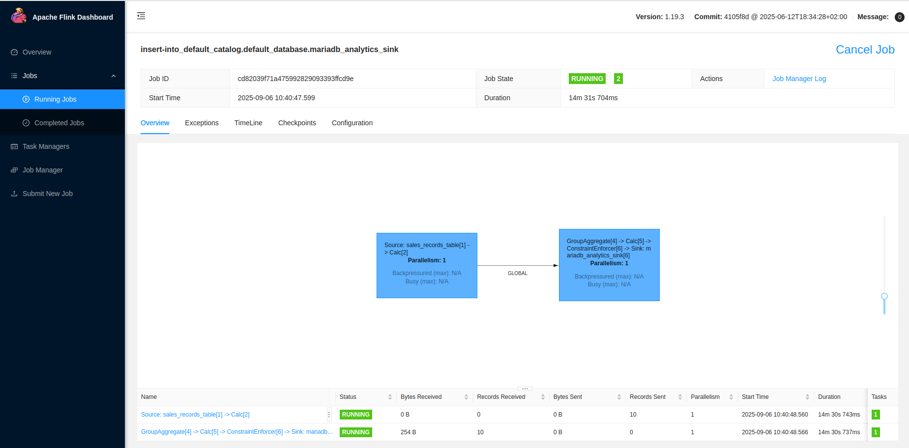

# Real-time Database Analytics with Apache Flink CDC

A complete real-time Change Data Capture (CDC) pipeline using Apache Flink, MariaDB, and Docker Compose. This project demonstrates how to build a modern streaming analytics system that processes database changes in real-time.

## What This Project Does

This project creates a **database-to-database CDC pipeline** that:

1. **Captures changes** from a MariaDB `sales_records` table in real-time
2. **Processes data** using Apache Flink to calculate running totals and analytics  
3. **Sinks results** back to a MariaDB `sales_analytics` table
4. **Provides monitoring** via Flink Web UI and Prometheus metrics

When you insert, update, or delete records in the source table, the analytics are automatically recalculated and updated within seconds.

## Architecture



### Components

- **Apache Flink 1.19.3** - Stream processing engine with Java 17
- **MariaDB 11.8 LTS** - Source and sink database with binlog enabled
- **MySQL CDC Connector 3.1.0** - Captures database changes
- **JDBC Connector 3.2.0** - Writes results back to database
- **Custom Docker Images** - All dependencies built-in for reliability

## Quick Start

### Prerequisites

- Docker and Docker Compose installed
- 8GB+ RAM recommended for Flink processing

### 1. Start the System

```bash
git clone <this-repo>
cd apache_flink_and_docker_compose
docker compose up -d --build
```

This will start:
- 1 MariaDB container (source + sink)
- 1 Flink JobManager 
- 2 Flink TaskManagers

### 2. Verify Containers

```bash
docker ps
```

You should see 4 containers running. MariaDB includes a healthcheck, so `jobmanager` will wait until the database is fully initialised before starting:

```
CONTAINER ID   IMAGE                                         STATUS                  NAMES
abc123...      apache_flink_and_docker_compose-jobmanager   Up 10 seconds           jobmanager
def456...      apache_flink_and_docker_compose-taskmanager  Up 10 seconds           taskmanager-1
ghi789...      apache_flink_and_docker_compose-taskmanager  Up 10 seconds           taskmanager-2
jkl012...      mariadb:11.8                                 Up 20 seconds (healthy) mariadb
```

### 3. Run the CDC Pipeline

```bash
docker exec jobmanager /opt/flink/bin/sql-client.sh embedded -f job.sql
```

You should see:
```
[INFO] Execute statement succeed.
[INFO] Execute statement succeed.  
[INFO] Execute statement succeed.
[INFO] Submitting SQL update statement to the cluster...
[INFO] SQL update statement has been successfully submitted to the cluster:
Job ID: <job-id>
```

### 4. Verify the Pipeline Works

Check that analytics were calculated:

```bash
docker exec mariadb mariadb -u root -prootpassword -e "USE sales_database; SELECT * FROM sales_analytics;"
```

Expected output:
```
metric_name  | metric_value | calculated_at
total_sales  | 5500.00      | 2025-09-06 09:29:39
```

## Testing Real-time CDC

### Add a New Sale

```bash
docker exec mariadb mariadb -u root -prootpassword -e "
USE sales_database; 
INSERT INTO sales_records (sale_id, product_id, product_name, sale_date, sale_amount) 
VALUES (11, 111, 'Product K', '2023-01-11', 1100.00);"
```

### Verify Real-time Update

```bash
docker exec mariadb mariadb -u root -prootpassword -e "USE sales_database; SELECT * FROM sales_analytics;"
```

The `metric_value` should update from `5500.00` to `6600.00` within seconds!

## 🔄 Continuous Processing in Action

The beauty of this CDC pipeline is that **the Flink job runs continuously**, monitoring the source database and updating analytics in real-time as data changes occur.

### Flink Web UI - Job Overview


This shows:
- **1 Running Job** - The CDC pipeline actively processing data
- **Job Status: RUNNING** - Continuously monitoring for database changes  
- **Duration: 14m+** - Job has been running and will continue indefinitely
- **2 Available Task Slots** - Ready to process new data immediately

### Flink Job Details - CDC Pipeline Flow


The job graph reveals the complete CDC pipeline:
- **Source**: `sales_records_table[1]` → `Calc[2]` (CDC from MariaDB)
- **Processing**: `GroupAggregate[4]` → `Calc[5]` → `ConstraintEnforcer[6]` (Real-time aggregation)
- **Sink**: `mariadb_analytics_sink[6]` (Write results back to database)

**Key Metrics**:
- **Records Processed**: 10 records from source table
- **Status**: Both source and sink tasks showing **RUNNING** 
- **Latency**: Sub-second processing from database change to analytics update
- **Throughput**: Ready to process new records as they arrive

> 💡 **The job continues running in the background**, automatically detecting any INSERT, UPDATE, or DELETE operations on the `sales_records` table and recalculating analytics within seconds.

## Monitoring and Management

### Flink Web UI
- **URL**: http://localhost:8081
- **Features**: Job monitoring, metrics, task manager status


### Database Access
```bash
# Connect to MariaDB
docker exec -it mariadb mariadb -u root -prootpassword sales_database

# View source data
SELECT * FROM sales_records;

# View analytics
SELECT * FROM sales_analytics;
```

## Project Structure

```
.
├── docker-compose.yml          # Container orchestration
├── Dockerfile                  # Custom Flink image with all dependencies
├── jobs/
│   └── job.sql                # Flink SQL CDC job definition
├── sql/
│   ├── init.sql               # MariaDB schema and sample data
│   └── mariadb.cnf           # MariaDB configuration with binlog
├── images/
│   ├── flink_screenshot_1.png # Flink Web UI overview
│   └── flink_screenshot_2.png # Job execution graph
└── README.md                  # This file
```

## How It Works

### 1. Data Source
- MariaDB with binlog enabled captures all row changes
- Sample data includes 10 sales records totaling $5,500

### 2. CDC Processing
- Flink MySQL CDC connector reads binlog in real-time
- Creates a streaming table `sales_records_table`
- Builds a continuous query to sum `sale_amount`

### 3. Analytics Output  
- Results written to `sales_analytics` table via JDBC
- Updates happen automatically when source data changes
- Includes timestamp of calculation

### 4. Built-in Dependencies
- All JARs downloaded during Docker build
- No version conflicts or classpath issues
- Consistent environment across deployments

## Customization

### Adding New Metrics

Edit `jobs/job.sql` to add more analytics:

```sql
-- Example: Average sale amount
CREATE TEMPORARY VIEW avg_sales AS
SELECT AVG(sale_amount) AS avg_sales_amount 
FROM sales_records_table;

-- Add to sink
INSERT INTO mariadb_analytics_sink
SELECT 'avg_sales' AS metric_name, 
       avg_sales_amount AS metric_value,
       CURRENT_TIMESTAMP AS calculated_at
FROM avg_sales;
```

### Scaling Task Managers

In `docker-compose.yml`:

```yaml
taskmanager:
  # ... 
  deploy:
    replicas: 4  # Increase for more parallelism
```

## Troubleshooting

### Job Fails to Start
```bash
# Check Flink logs
docker logs jobmanager

# Verify database connectivity
docker exec mariadb mariadb -u root -prootpassword -e "SHOW DATABASES;"
```

### CDC Not Working
```bash
# Verify binlog is enabled
docker exec mariadb mariadb -u root -prootpassword -e "SHOW VARIABLES LIKE 'log_bin';"
# Should show: log_bin | ON
```

### Performance Issues
- Increase Docker memory allocation (8GB+ recommended)
- Scale task managers up via `docker compose up --scale taskmanager=4`
- Monitor via Flink Web UI at http://localhost:8081

## Fault Tolerance and Recovery

This project includes Flink checkpointing so you can observe and test recovery behavior locally.

### What's Configured

- **Checkpointing**: Enabled every 60 seconds with `EXACTLY_ONCE` mode
- **State backend**: `hashmap` with checkpoints persisted to a Docker named volume
- **Restart strategy**: `fixed-delay` with up to 3 restart attempts, 10 seconds apart
- **Task slots**: Each TaskManager has 2 slots, so the job can recover onto a single surviving TaskManager

### Recovery Semantics

Flink checkpoints store the CDC binlog position, so on recovery the source connector resumes from where it left off — no events are lost.

The JDBC sink provides **at-least-once** delivery. Because the sink table uses a `PRIMARY KEY` with upsert semantics (`INSERT ... ON DUPLICATE KEY UPDATE`), duplicate writes are idempotent and the result remains correct after recovery.

### Testing Recovery Locally

1. **Start the stack and submit the job**

```bash
docker compose up -d --build
docker exec jobmanager /opt/flink/bin/sql-client.sh embedded -f job.sql
```

2. **Verify the pipeline is working**

```bash
docker exec mariadb mariadb -u root -prootpassword -e "USE sales_database; SELECT * FROM sales_analytics;"
```

3. **Insert a new record**

```bash
docker exec mariadb mariadb -u root -prootpassword -e "
USE sales_database;
INSERT INTO sales_records (sale_id, product_id, product_name, sale_date, sale_amount)
VALUES (11, 111, 'Product K', '2023-01-11', 1100.00);"
```

4. **Kill a TaskManager to simulate failure**

```bash
docker compose kill taskmanager --signal SIGKILL
```

5. **Restart the TaskManager**

```bash
docker compose up -d taskmanager
```

6. **Wait for recovery and verify**

Open the Flink Web UI at http://localhost:8081 and watch the job transition from `RESTARTING` back to `RUNNING`. Then check that the analytics are still correct:

```bash
docker exec mariadb mariadb -u root -prootpassword -e "USE sales_database; SELECT * FROM sales_analytics;"
```

The `metric_value` should reflect all records, including the one inserted before the failure.

### Limitations of the Local Setup

- Checkpoints are stored on a shared Docker volume, not a distributed filesystem. In production you would use S3, HDFS, or similar.
- With 2 TaskManager replicas and 2 slots each, there are enough slots to recover from a single TaskManager failure. Losing both TaskManagers simultaneously requires a full restart.
- The `hashmap` state backend keeps state in memory. For larger state, the `rocksdb` backend would be more appropriate.

## Technical Notes

- **Flink Version**: 1.19.3 with Java 17
- **CDC Latency**: Typically <1 second for simple aggregations
- **Fault Tolerance**: Checkpointing every 60s with exactly-once source, at-least-once sink (idempotent via upsert)
- **Database Compatibility**: Works with MySQL 5.6+, MariaDB 10.x+ (tested with 11.8 LTS)

Built using modern Docker practices with dependency management inspired by successful production deployments.